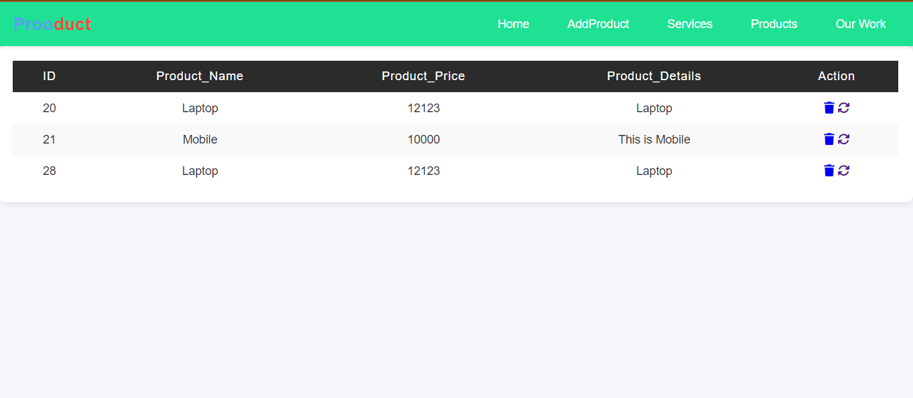
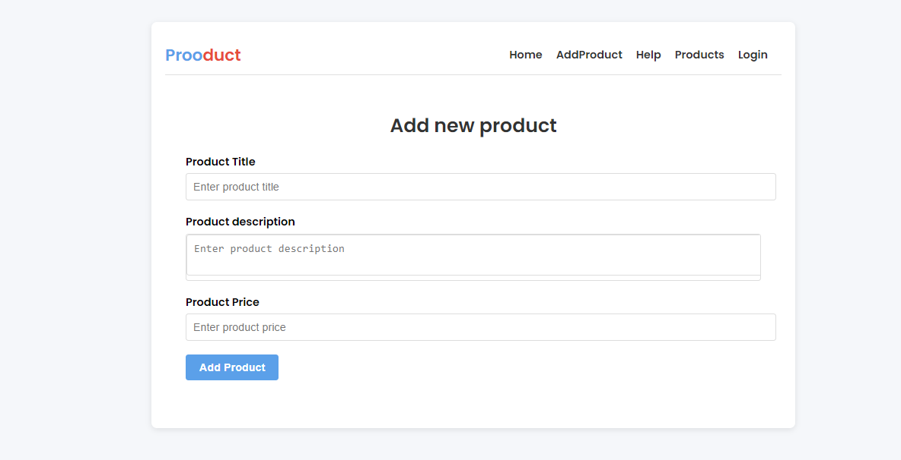
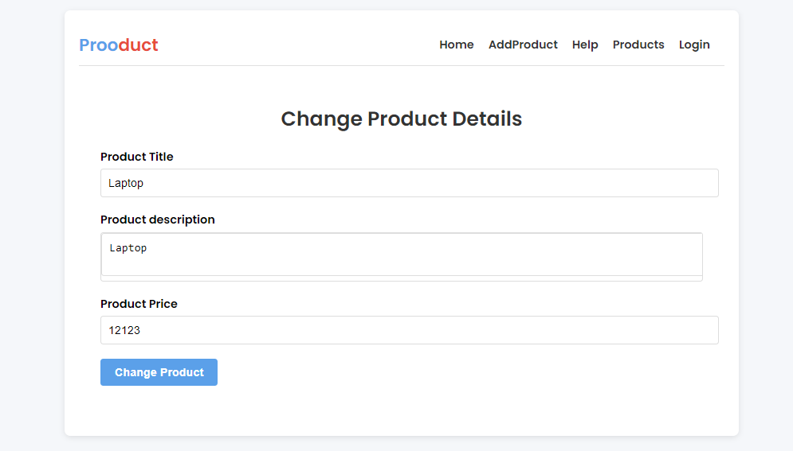

# ProductAPP

ProductAPP is a Spring MVC-based web application designed to manage products. It supports operations like creating, reading, updating, and deleting (CRUD) product information, including product name, product ID, product description, and price. 

## Features

- **Add Product**: Create new products with name, description, price, and an optional image.
- **View Products**: List all products in a tabular format.
- **Update Product**: Modify existing product details.
- **Delete Product**: Remove products from the database.

## Technologies Used

- **Spring MVC**: For building the web application.
- **Hibernate**: For ORM and database operations.
- **Jakarta EE**: For JPA.
- **MySQL**: Database for storing product information.
- **JSTL**: For rendering views in JSP.
- **Tomcat 10**: As the servlet container.
- **Html,Css & Js**: For styling and responsive design.

## Screenshots

### Home Page

### Add Product Page

### Update Product Page

